# Codepin

Pin, organize, and instantly navigate to your most important code.

#### Why Codepin?
- Easily return to the code you care about.

- Keep notes, tags, and reminders attached to your pins & folders, not scattered in comments.

- Organize your workflow, whether you’re working alone or sharing things with your team.

Just a practical tool to help you stay organized.

### ✨ Features

#### 📌 Add Pins
- Pin a line for fast navigation.
---

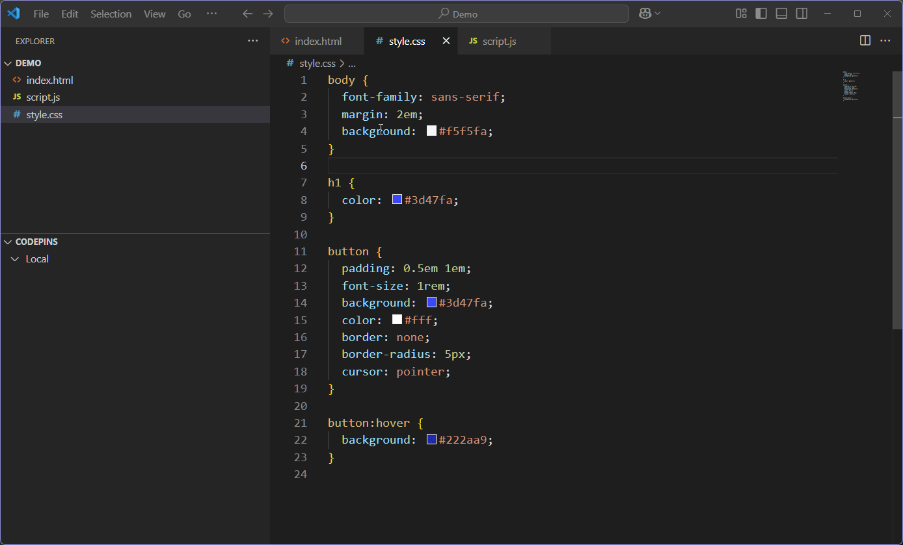

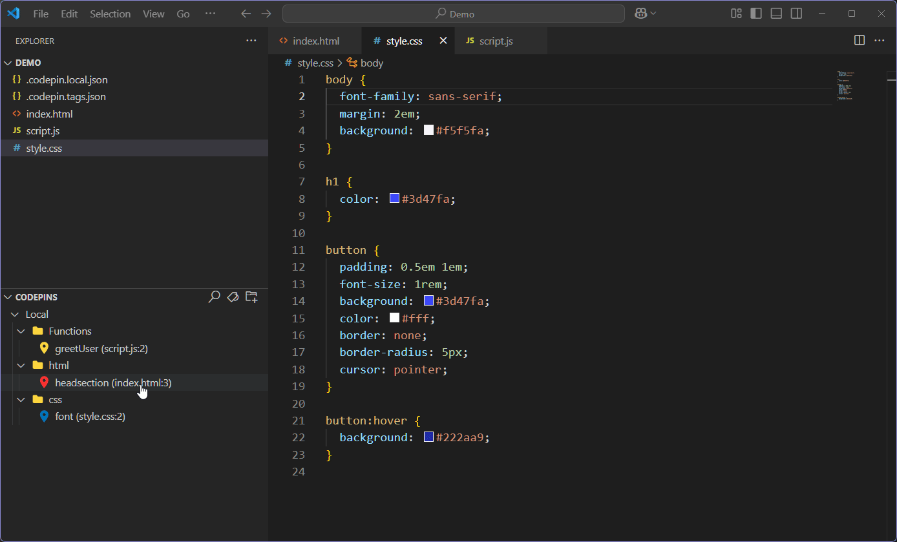

---

#### 📁 Add Folders
- Add folders for better organization.
---

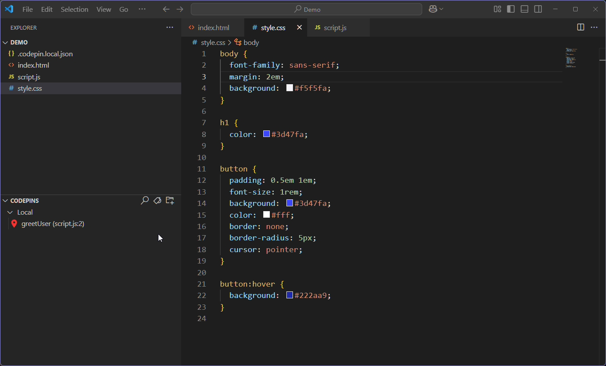

---

#### 🏷️ Tag Manager
- Create custom tags for your projects.
- Tags can be assigned to your pins and folders.
---

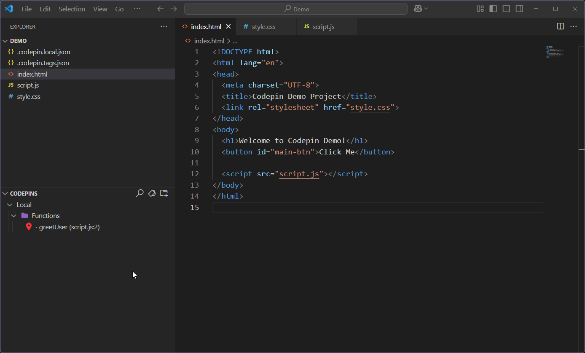

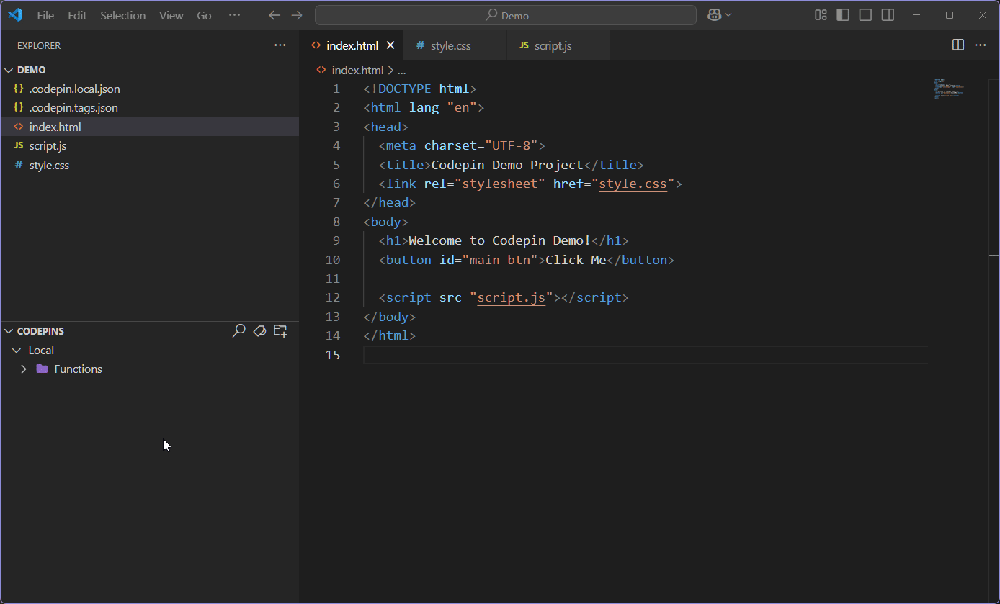

---

#### 📝 Add Notes
- Attach notes to any pin/folder.
---

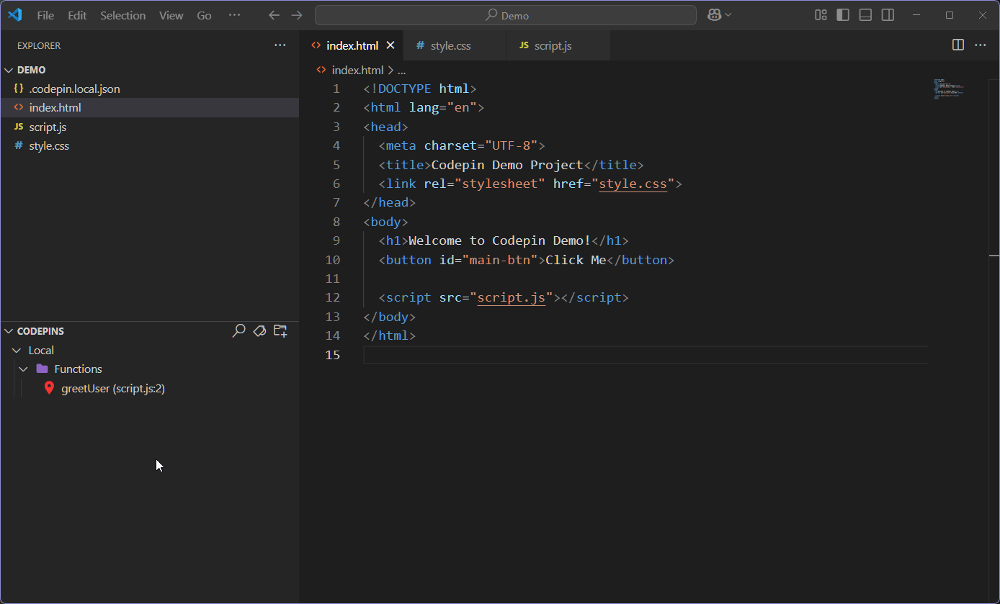

---

#### 📂 Organize, Search & Undo
- Drag, drop, reorder, undo and quicksearch to your hearts content.
---

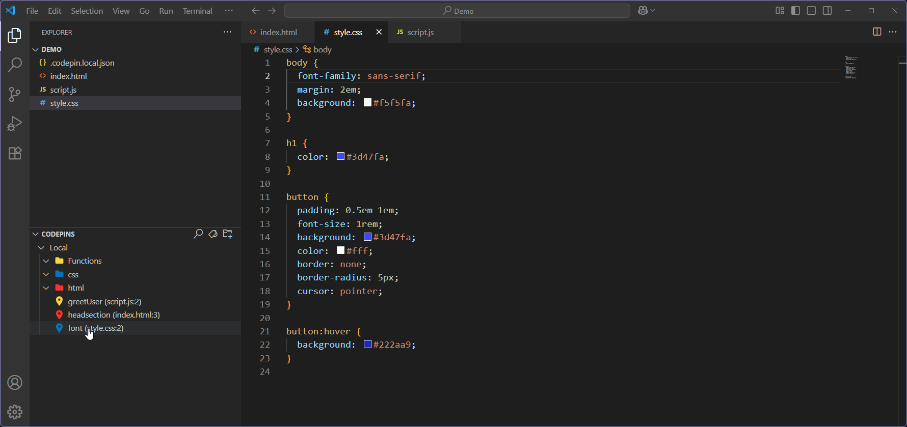

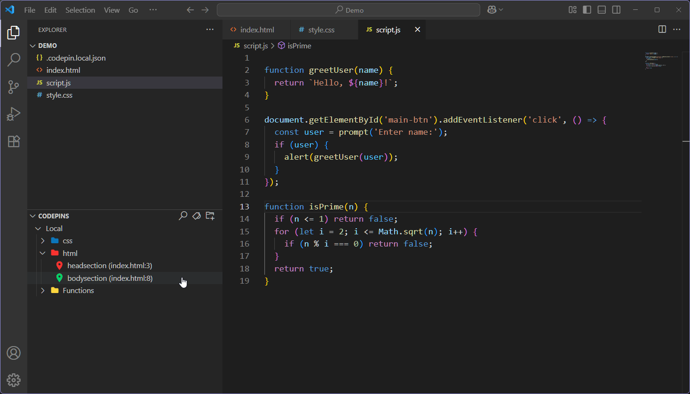

### 🔑 Codepin Pro Features

#### Unlock unlimited pins, folders, tags, and new colors — plus features like multiline pinning and the team workspace.

---

#### ⭐ Pin with multiline support (Codepin Pro)
- Pin sections or blocks with multiline support, not just single lines.
---

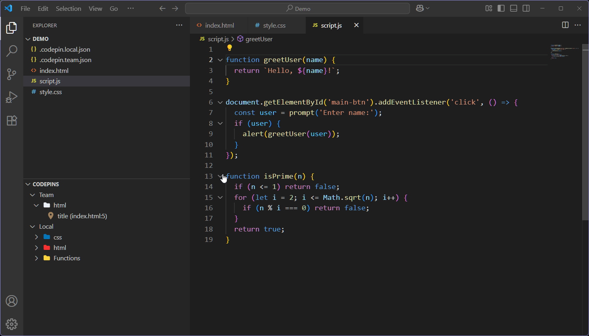

---

#### ⭐ Team & Local (Codepin Pro)
- With a Codepin Pro License, you can switch between **Local** pins (just for you) and **Team** pins (shared with everyone in your workspace).
---

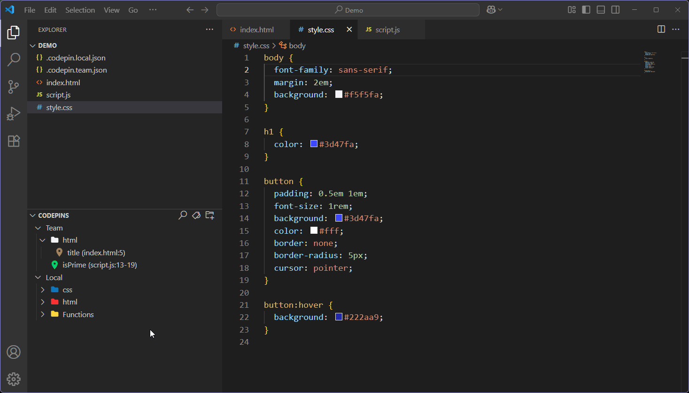

---

### Getting started

1. Install Codepin from [VS Code Marketplace](https://marketplace.visualstudio.com/vscode)

2. Open the Codepin sidebar from the Explorer tab.

3. Select a line of code and Right-Click or (Ctrl+Alt+P) to create a pin.

4. Click the folder icon in the Codepins sidebar or (Ctrl+Alt+F) to create a folder

5. Hover on a pin or folder to see tooltip (full path, line number & code, notes).

6. Click the Tag Manager button in the Codepins sidebar or (Ctrl+Alt+T) to open the Tag Manager.

### Settings

- Open pin on click: Open pin when you click it. Turned on by default.

- Show Full Path: Shows full path of the pin + line number. Turned on by default.

- Show Tag Colors: Removes the icons from tags. Turned on by default.

### Keyboard Shortcuts

- Add pin: Ctrl+Alt+P (when editing code).

- New folder: Ctrl+Alt+F

- Search: Ctrl+Alt+S

- Tag Manager: Ctrl+Alt+T

- You can customize shortcuts in the Keyboard Shortcuts settings.

### Pro license

- Purchase your Pro license at Gumroad [Codepin Pro License Key](https://echogrid.gumroad.com/l/codepinprolicensekey).

- Enter your license key in the extension (Command Palette).

- Enjoy unlimited pins, folders, and all Pro features!

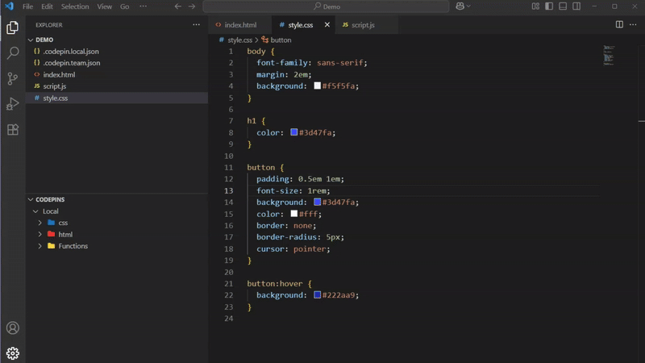

---

### FAQ

**Where are my pins stored?**
- Local pins/folders: stored in .codepin.local.json (not shared) and (for Pro/team).
- Team pins/folders: stored in .codepin.team.json (shared via git, if you commit it)

**How do I backup or share pins?**
- Just copy these files to another workspace or repo.

**Is my code/data sent anywhere?**
- No. All your pin data stays local, except license checks which go to Gumroad.

**What happens if I uninstall Codepin?**
- Your pins remain in your project folders.