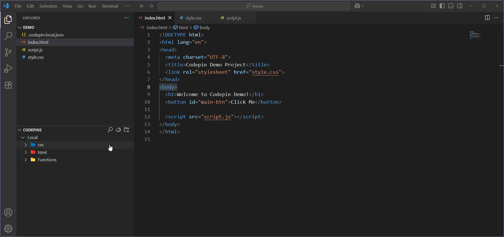

# Codepin

Pin, organize, and instantly jump to your most important code.

## Why Codepin?
- Easily return to the code you care about.

- Keep notes and tags attached to your pins & folders, not scattered in comments.

- Organize your workflow, whether you’re working alone or sharing things with your team.

## ✨ Features

#### 📌 Add Pins
- Pin a line for fast navigation

#### 📁 Add Folders
- Organize pins into folders

#### 🏷️ Tag Manager
- Create custom tags
- Assign tags to any pin/folder

#### 📄 Add Notes
- Attach notes to pins and folders

#### 📂 Organize, Search & Undo
- Drag, drop, reorder, undo, and quicksearch

## ⭐ Codepin Pro Features

## ✨ Codepin Free
- Up to 20 pins per workspace
- Up to 5 folders per workspace
- Up to 5 tags per workspace
- Up to 5 colors for tags, pins, and folders 🟥🟨🟦🟩🟪
- Unlimited notes

## ⭐ Codepin Pro 
- Everything in Free, plus:
- Unlimited pins, folders, tags, and colors 🟧🟫⬛⬜
- Multiline pinning
- Team & Local mode (easily switch between private and shared pins/folders)

#### ⭐ Pin with multiline support
- Pin sections or blocks with multiline support, not just single lines.

#### ⭐ Team & Local
- With a Codepin Pro License, you can switch between **Local** pins (just for you) and **Team** pins (shared with everyone in your workspace).

## 🛠️ Getting started

1. Install Codepin from [VS Code Marketplace](https://marketplace.visualstudio.com/vscode)

2. Open the Codepin sidebar from the Explorer tab.

3. Select a line of code and Right-Click or (Ctrl+Alt+P) to create a pin.

4. Click the folder icon in the Codepins sidebar or (Ctrl+Alt+F) to create a folder

5. Hover on a pin or folder to see tooltip (full path, line number & code, notes).

6. Click the Tag Manager button in the Codepins sidebar or (Ctrl+Alt+T) to open the Tag Manager.

## ⚙️ Settings

- Open pin on click: Open pin when you click it. Turned on by default.

- Show Full Path: Shows full path of the pin + line number. Turned on by default.

- Show Tag Colors: Removes the icons from tags. Turned on by default.

## ⌨️ Keyboard Shortcuts

- Add pin: Ctrl+Alt+P (when editing code).

- New folder: Ctrl+Alt+F

- Search: Ctrl+Alt+S

- Tag Manager: Ctrl+Alt+T

- All shortcuts are customizable via VS Code’s Keyboard Shortcuts settings.

## ⭐ Pro license

- Purchase your Pro license on [Gumroad](https://echogrid.gumroad.com/l/codepinprolicensekey).

- Enter your license key in the extension (via the Command Palette).

- Enjoy unlimited pins, folders, and all Pro features!

## ❓ FAQ

**Where are my pins stored?**
- Local pins/folders: stored in .codepin.local.json (not shared).
- Team pins/folders: stored in .codepin.team.json (shared via git, if you commit it)

**How do I backup or share pins?**
- Just copy these files to another workspace or repo.

**Is my code/data sent anywhere?**
- No. All your pin data stays local, except license checks which go to Gumroad.

**What happens if I uninstall Codepin?**
- Your pins remain in your project folders.

**Why is Codepin not completely free?**

Building and maintaining Codepin takes time.  
The free version covers most needs for individual developers or smaller projects,  
and Codepin Pro is for those working in bigger teams,
with larger projects, or anyone who wants more flexibility and/or features.  

The Pro license helps support future development for Codepin.

## 🤝 Support & Contributing

Found a bug or have a suggestion?  
Open an issue or pull request on [GitHub](https://github.com/echogridstudio/Codepin).

If you find Codepin helpful, please ⭐ the repo or share it with others!

## 📝 License

Codepin is open source under the [MIT License](/LICENSE)